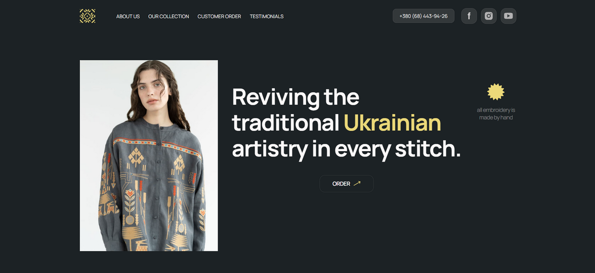

# Vyshyvanka Vibes – A Touch of Ukrainian Culture in Every Stitch 🧵🇺🇦👕

🔗 **Live demo:**
[https://constantinekobushka.github.io/vyshyvanka-vibes](https://constantinekobushka.github.io/vyshyvanka-vibes)



## 🔎 Project Description

Vyshyvanka Vibes is a modern one-page website (landing page), created by a team
of talented developers in a mobile-first style, with responsive design for
screen widths of 320px, 768px, and 1440px.

🪡 The site includes a user-friendly mobile menu with smooth anchor link
scrolling 🔗 and a functional product order form — **"Your Order"** 📋.

🧶 With this website, you can easily order a handmade embroidered Ukrainian
shirt. Browse our large gallery of authentic products 👕🖼️. Many happy customers
have already placed orders and left ⭐️ reviews.

Built for those who appreciate **quality**, **craftsmanship**, and **cultural
heritage**.

---

## 🌟 Key Features

- 📱 Responsive mobile menu
- 📨 Quick product order form
- ⚙️ "Order Now" button
- 🎞️ Image slider powered by Swiper.js

---

## 🧰 Tech Stack

### 🔨 Frontend

- **HTML5** – semantic and structured markup
- **CSS3** – styling and responsive layout
- **JavaScript** – interactive logic and event handling
- **Swiper.js** – gallery and product slider

---

## 🚀 Installation & Launch

### 📦 Clone the repository:

```bash
git clone https://github.com/ConstantineKobushka/vyshyvanka-vibes
cd vyshyvanka-vibes
npm install
npm run dev
```
